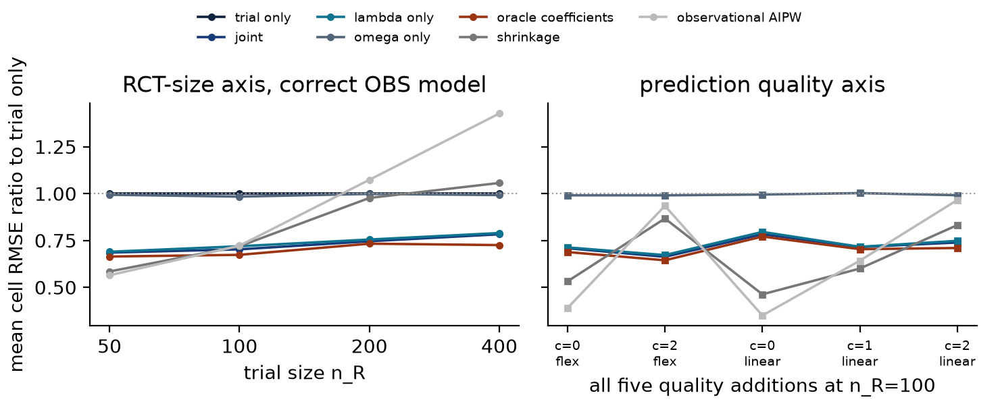
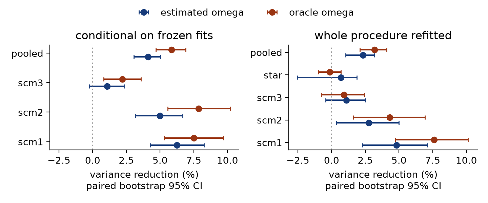
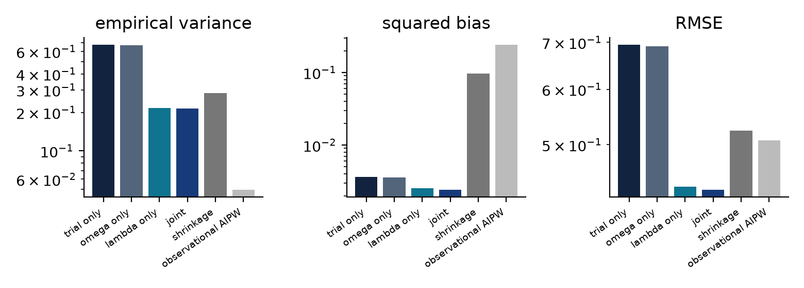
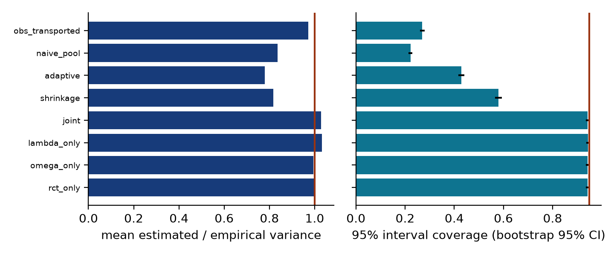
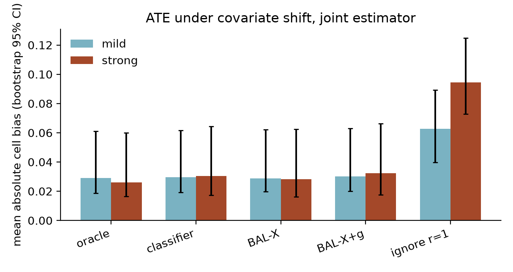
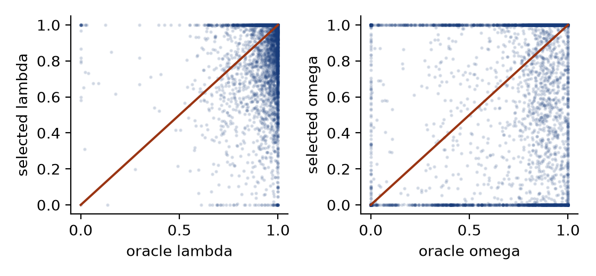

# DataFusionPPI ATE implementation and results

This note is the ATE-only publication record for the `rev4-2026-09-12` results.
The statistical specification remains `2026-09-09-implementation-handoff-JA.md`.
The independent replication counts below count generated data sets, not estimator,
ratio-route, metric, or long-format rows.

## Reproducible surface

- `exp_ate1.py` generates ATE-1. It uses 44 design cells and 100 independent
  replications per cell, for 4,400 generated data sets.
- `exp_ate2.py` generates ATE-2. The synthetic panel has 1,200 generated data
  sets, paired across five ratio routes. The NSW panel has 600 generated data
  sets, paired across four feasible routes. The CSV contains 42,000 estimator
  rows because route and estimator outputs repeat each generated data set.
- `exp_conditional_variance.py` freezes 15 fitted nuisance/coefficient states and
  generates 400 independent evaluation draws per state, for 6,000 evaluation
  draws and 42,000 estimator rows.
- `exp_ate_star_real.py` reproduces the ATE projection of the STAR real-outcome
  stress test: 8 cells and 100 independent replications per cell, for 800 data
  sets and 8,000 estimator rows.
- `analysis_variance.py` computes cellwise ATE bias, empirical variance, mean
  squared error (MSE), root MSE (RMSE), interval coverage, and paired-bootstrap
  variance reductions. `make_ate_figures.py` reads only frozen ATE CSVs.

## Aggregation estimands

ATE-1 tables give each of the 44 prespecified design cells equal weight. A pooled
variance-reduction rate is the mean of the 44 cell-specific rates, recomputed in
each paired bootstrap draw. It is not the ratio of two variances after pooling all
replications. RMSE ratios are computed within a cell and then averaged. Coverage
is the equal-cell mean of the empirical 95 percent Wald-interval coverage.

ATE-2 synthetic bias in Figure 4 is the mean across six cells of the absolute
cell bias, where a cell is one family and one trial size at a fixed shift and
ratio route. Its interval resamples replication indices inside every cell, keeps
all five routes paired, and recomputes the full statistic. It is not the absolute
value of a pooled signed bias.

The conditional-variance experiment conditions on each frozen fitted state.
Its target is the exact evaluation-sample variance in Theorem 1. The STAR ATE
stress test uses the law-weighted within-pattern contrast as its reference.

## Main results

For ATE-1, the mean cellwise RMSE ratio to trial-only is 0.748 for the joint
estimator, 0.759 for lambda-only, 0.994 for omega-only, and 0.707 for the oracle
joint coefficients. With lambda held fixed, estimated omega reduces whole-
procedure variance by 2.34 percent, with paired-bootstrap 95 percent interval
[1.04, 3.19]. Conditional on frozen fitted objects, the corresponding reduction
is 4.11 percent [3.06, 5.02]. The joint estimator has pooled coverage 0.9423,
against 0.9416 for trial-only.

In synthetic ATE-2, the joint estimator's mean absolute cell bias under mild
shift is 0.0290 with the oracle ratio, 0.0295 with the classifier, 0.0288 with
BAL-X, 0.0302 with BAL-X+g, and 0.0626 when the ratio is set to one. Under
strong shift, the corresponding values are 0.0261, 0.0305, 0.0283, 0.0324,
and 0.0945. Figure 4 reports the same statistic with paired within-cell
bootstrap intervals. The result isolates transport: ignoring the ratio adds
substantial bias, while the three estimated weighted routes remain close to
the oracle route.

Across the 105 frozen-fit and coefficient-rule comparisons, every empirical
variance lies within three Monte Carlo standard errors of the Theorem 1 value;
the largest absolute standardized gap is 1.679. The 400-draw expansion is an
exploratory variance diagnostic.

In the STAR real-outcome ATE stress test, the joint estimator has equal-cell mean
bias -0.00006, RMSE 0.07862, and coverage 0.9613. Trial-only has bias 0.00008,
RMSE 0.07918, and coverage 0.9588. This is a stress-test comparison against the
law-weighted reference, not identification of an individual-level conditional
effect.

## Limits and provenance

The ATE-1 Wald intervals are asymptotic. The cross-fitted joint row is a
reference-only panel because overlapping folds require a separate variance
argument. NSW results compare routes against an experimental benchmark and do
not supply a known population truth. Oracle coefficients and the conditional-
variance expansion are simulation diagnostics.

The run used base seed 190602 with deterministic derived seeds. The environment
is recorded in `requirements-ate.txt`. Source data are hash-checked by
`fusion_data.py`. `ate-artifact-manifest.sha256` binds the published code,
results, figures, report, and retained historical ATE pilot/benchmark surface.
The manifest intentionally does not hash itself.

## Commands

```bash
python3 -m pytest -q -p no:cacheprovider code/test_ate_acceptance.py
python3 code/exp_ate1.py --replications 100 --stem ate1_when_fusion_helps
python3 code/exp_ate2.py --replications 100 --stem ate2_shift
python3 code/exp_conditional_variance.py --training-draws 5 --evaluations 400 --stem conditional_variance_400
python3 code/exp_ate_star_real.py --replications 100 --stem cate2_star_real_ate
python3 code/analysis_variance.py --stem ate1_when_fusion_helps
python3 code/analysis_variance.py --stem conditional_variance_400 --group family,training_draw
python3 code/make_ate_figures.py
```

## 한국어 해설: ATE 결과를 어떻게 읽을 것인가

이 절은 앞의 영문 재현성 기록을 바꾸지 않고, 여섯 ATE 그림이 무엇을
측정하며 어디까지 결론을 지지하는지 처음부터 설명한다.

### 1. 먼저 필요한 기호와 평가량

관심 대상은 RCT 모집단의 평균처리효과, ATE이다. 개인의 공변량을 $X$,
조건부 처리효과를 $\tau(X)$라고 쓰면 목표값은

$$
\theta=\mathbb E_R\{\tau(X)\}
$$

이다. 아래첨자 $R$은 RCT 모집단, $O$는 observational, 즉 OBS 모집단을
뜻한다. $n_R$과 $N_O$는 각각 RCT와 OBS의 표시 표본 크기다. 평가 역할에
실제로 들어간 크기는 간단히 $n$과 $N$으로 쓴다.

반복실험에서 추정값을 $\widehat\theta$라고 할 때 다음 양을 구분해야 한다.

- bias는 $\mathbb E(\widehat\theta-\theta)$이다. 0에 가까울수록 평균적으로
  목표를 잘 맞춘다.
- variance는 $\widehat\theta$가 반복마다 얼마나 달라지는지 나타낸다.
- MSE는 $\mathbb E\{(\widehat\theta-\theta)^2\}$이고, RMSE는 그 제곱근이다.
  따라서 RMSE는 bias와 variance를 함께 반영한다.
- coverage는 명목 95% 신뢰구간이 실제 $\theta$를 포함한 반복의 비율이다.
  이상적인 기준은 0.95이지만, 유한 반복에서는 정확히 0.95일 필요는 없다.

`cell`은 하나의 사전 지정 실험조건이다. 예를 들어 한 data-generating
family, 한 $n_R$, 한 교란 강도, 한 outcome-model specification의 조합이 한
cell이다. 이 보고서의 `mean cell` 통계량은 각 cell에서 먼저 값을 계산한
뒤, cell들을 동일 가중 평균한다.

### 2. 두 결합 채널과 transport identity

$Z_0$는 RCT outcome regression으로 만든 기본 pseudo-outcome이고,
$\Delta$는 OBS outcome regression을 섞을 때 생기는 변화량이다. 첫 번째
결합계수 $\lambda\in[0,1]$는

$$
Z_\lambda=Z_0+\lambda\Delta
$$

를 통해 pseudo-outcome 안의 regression을 바꾼다. $\widehat g(X)$는 OBS에서
적합한 outcome-prediction contrast이고, $r(X)$는 OBS의 공변량 평균을 RCT
모집단으로 옮기는 density ratio 후보이다. $\mathbb P_{R,n}$과
$\mathbb P_{O,N}$은 각각 평가 RCT와 평가 OBS에서의 표본평균이다.

고정된 $(\lambda,\omega)$에서 추정량은

$$
\widehat\theta_r(\lambda,\omega)
=
\mathbb P_{R,n}Z_\lambda
+\omega\left\{
\mathbb P_{O,N}(r\widehat g)-\mathbb P_{R,n}\widehat g
\right\}.
$$

두 번째 결합계수 $\omega\in[0,1]$는 중괄호 안의 control variate 크기를
정한다. 참 density ratio $r_0$에 대해서는 transport identity

$$
\mathbb E_O\{r_0(X)\widehat g(X)\}
=
\mathbb E_R\{\widehat g(X)\}
$$

가 성립한다. 따라서 $r=r_0$이면 $\omega$ 항의 모집단 평균은 0이다.
즉, $\omega$ 채널은 목표 ATE를 바꾸지 않으면서 RCT 항과 음의 공분산을
만들어 variance를 줄이도록 설계된다. 반대로 $r$가 틀리면 이 평균 0
성질이 깨져 transport bias가 생길 수 있다.

참 ratio와 고정된 fitted objects 아래의 분산은

$$
\operatorname{Var}\{\widehat\theta_{r_0}(\lambda,\omega)\}
=
\frac1n\operatorname{Var}_R\{Z_\lambda-\omega\widehat g(X)\}
+
\frac{\omega^2}{N}\operatorname{Var}_O\{r_0(X)\widehat g(X)\}
$$

이다. Tuning 표본에서

$$
\widehat B
=
\widehat{\operatorname{Var}}_R(\widehat g)
+\frac nN\widehat{\operatorname{Var}}_O(\widehat r\widehat g),
\qquad
\widehat D
=
\widehat{\operatorname{Cov}}_R(Z_0,\widehat g)
$$

를 계산하고,

$$
\widehat\omega
=
\operatorname{Proj}_{[0,1]}
\left(\frac{\widehat D}{\widehat B}\right)
$$

를 사용한다. 여기서 $\operatorname{Proj}_{[0,1]}$은 값을 $[0,1]$ 안으로
제한하는 연산이다. Oracle은 같은 fitted objects를 고정하고 매우 큰 독립
Monte Carlo 표본으로 $B$와 $D$를 근사하여

$$
\omega^\star
=
\operatorname{Proj}_{[0,1]}
\left(\frac{D}{B}\right)
$$

를 계산한다. 이는 실제 분석에서 사용할 수 있는 estimator가 아니라,
현재 구조에서 얻을 수 있는 variance reduction의 참고 상한이다.

### 3. Estimated omega와 oracle omega를 왜 함께 보는가

Conditional simulation은 nuisance fit과 선택된 계수를 먼저 고정한 뒤,
새 evaluation samples만 반복 생성한다. 이 실험은 학습 알고리즘 전체의
변동이 아니라, 주어진 fitted objects 아래의 evaluation-sample variance를
직접 검사한다. 3개 synthetic family에서 5개의 frozen state를 만들고,
각 state마다 400개의 독립 evaluation draw를 사용했다. 총 15개 state와
6,000개의 evaluation draw이다.

Estimated $\omega$와 oracle $\omega$를 비교하면 다음 두 질문을 분리할 수
있다.

1. 현재 $\widehat\omega$가 실제로 variance를 줄이는가?
2. 모집단에 가까운 moment를 알았다면 더 줄일 여지가 있었는가?

다만 두 곡선의 차이를 그대로 $\omega$ estimation error라고 부르면 안
된다. Estimated 비교는 선택된 $\lambda$를 고정한 `lambda-only` 대 `joint`이고,
oracle 비교는 oracle $\lambda$를 고정한 `oracle-lambda-only` 대
`oracle-joint`이다. 기준 $\lambda$ 자체가 다르다. 또한 이 비교는 bias
감소, coefficient consistency, causal identification을 증명하지 않는다.

### 4. Figure 1: RCT 크기와 예측 품질에 따른 RMSE



세로축은 각 cell에서 계산한 `estimator RMSE / trial-only RMSE`를 family에
걸쳐 동일 가중 평균한 값이다. 1보다 작으면 trial-only보다 RMSE가 작다.
왼쪽은 올바른 OBS outcome model에서 $n_R$만 바꾼 결과다. 각 점은 4개
family의 평균이고, 각 cell에는 100개의 독립 replication이 있다.

| estimator | $n_R=50$ | $n_R=100$ | $n_R=200$ | $n_R=400$ |
|---|---:|---:|---:|---:|
| trial-only | 1.0000 | 1.0000 | 1.0000 | 1.0000 |
| joint | 0.6852 | 0.7025 | 0.7456 | 0.7829 |
| lambda-only | 0.6896 | 0.7191 | 0.7549 | 0.7896 |
| omega-only | 0.9936 | 0.9837 | 0.9981 | 0.9921 |
| oracle joint | 0.6642 | 0.6732 | 0.7328 | 0.7252 |
| shrinkage | 0.5845 | 0.7190 | 0.9768 | 1.0567 |
| OBS transported | 0.5644 | 0.7221 | 1.0736 | 1.4275 |

오른쪽은 $n_R=100$에서 다섯 prediction-quality addition을 비교한다. 열의
순서는 그림과 같다.

| estimator | $c=0$, flex | $c=2$, flex | $c=0$, linear | $c=1$, linear | $c=2$, linear |
|---|---:|---:|---:|---:|---:|
| joint | 0.7085 | 0.6627 | 0.7831 | 0.7148 | 0.7390 |
| lambda-only | 0.7130 | 0.6719 | 0.7956 | 0.7161 | 0.7479 |
| omega-only | 0.9908 | 0.9905 | 0.9949 | 1.0025 | 0.9913 |
| oracle joint | 0.6882 | 0.6441 | 0.7709 | 0.7034 | 0.7098 |
| shrinkage | 0.5315 | 0.8671 | 0.4626 | 0.6001 | 0.8319 |
| OBS transported | 0.3890 | 0.9347 | 0.3500 | 0.6422 | 0.9657 |

안전한 결론은 joint의 큰 RMSE 개선이 주로 $\lambda$ 채널에서 오고,
$\omega$가 작지만 대체로 일관된 추가 개선을 준다는 것이다. OBS-only와
shrinkage는 일부 작은-$n_R$ 조건에서 더 좋지만, $n_R$이 커지면 bias 때문에
trial-only보다 나빠질 수 있다. 따라서 이 두 baseline의 uniform dominance를
주장할 수 없다. 이 그림에는 uncertainty interval이 없고, 값은 pooled
RMSE의 비율이 아니라 cellwise RMSE ratio의 평균이다.

### 5. Figure 1 omega: incremental variance reduction



가로축은 $100\{1-\operatorname{Var}(\text{on})/
\operatorname{Var}(\text{off})\}$이다. Estimated 비교에서 off는
lambda-only, on은 joint이다. Oracle 비교에서 off는 oracle-lambda-only,
on은 oracle-joint이다. 괄호는 replication index를 cell 안에서 paired하게
재표집한 bootstrap 95% interval이다.

| scope | family | estimated $\omega$ | oracle $\omega$ |
|---|---|---:|---:|
| frozen fits | scm1 | 6.25% [4.26, 8.27] | 7.50% [5.32, 9.69] |
| frozen fits | scm2 | 4.99% [3.19, 6.69] | 7.85% [5.58, 10.19] |
| frozen fits | scm3 | 1.08% [-0.23, 2.34] | 2.19% [0.82, 3.59] |
| frozen fits | pooled | 4.11% [3.06, 5.02] | 5.85% [4.70, 6.91] |
| whole procedure | scm1 | 4.82% [2.27, 7.12] | 7.62% [4.74, 10.11] |
| whole procedure | scm2 | 2.75% [0.34, 4.99] | 4.31% [1.60, 6.92] |
| whole procedure | scm3 | 1.10% [-0.44, 2.50] | 0.92% [-0.73, 2.44] |
| whole procedure | STAR | 0.69% [-2.53, 1.89] | -0.14% [-0.97, 0.70] |
| whole procedure | pooled | 2.34% [1.04, 3.19] | 3.17% [2.11, 4.10] |

Whole-procedure 결과는 4개 family, family당 11개 cell, cell당 100개
replication을 사용한다. Pooled 값은 cell-specific reduction rate의 동일
가중 평균이다. Frozen nuisance 조건의 4.11%가 전체 절차의 2.34%보다
크다는 것은 nuisance와 coefficient를 다시 학습하는 변동이 실현 가능한
gain 일부를 소모한다는 뜻이다. Pooled 수준에서는 작은 양의 gain이
관측되지만, scm3와 STAR의 interval은 0을 포함한다. 모든 family에서
양의 gain이 입증되었다고 쓰면 안 된다.

### 6. Figure 2: variance, bias squared, RMSE의 분해



이 그림은 RCT-size axis의 16개 cell, 즉 4개 family와 4개 $n_R$ 조합을
동일 가중 평균한다. 각 cell에는 100개 replication이 있다.

| estimator | empirical variance | mean cell bias$^2$ | mean cell RMSE |
|---|---:|---:|---:|
| trial-only | 0.678689 | 0.003615 | 0.694826 |
| omega-only | 0.673442 | 0.003556 | 0.690523 |
| lambda-only | 0.217562 | 0.002551 | 0.435492 |
| joint | 0.213611 | 0.002402 | 0.430922 |
| shrinkage | 0.283521 | 0.096168 | 0.524153 |
| OBS transported | 0.049419 | 0.242237 | 0.507005 |

$\lambda$가 variance 감소의 대부분을 만들고, $\omega$가 추가로 작게
개선한다. OBS transported는 variance가 가장 작지만 bias$^2$가 크므로
variance만 보고 좋은 estimator라고 결론 내릴 수 없다. Joint는 이 axis에서
낮은 variance와 낮은 bias를 함께 유지한다. 세 패널은 로그축이고 uncertainty
bar가 없다. 표시된 RMSE는 cell RMSE의 평균이므로
$\sqrt{\text{평균 MSE}}$와 동일하지 않다.

### 7. Figure 3: variance formula와 95% interval coverage



왼쪽은 RCT-size axis 16개 cell에서
`mean estimated variance / empirical variance`를 평균한 값이다.

| estimator | estimated / empirical variance |
|---|---:|
| trial-only | 1.0020 |
| omega-only | 0.9948 |
| lambda-only | 1.0328 |
| joint | 1.0281 |
| shrinkage | 0.8179 |
| adaptive | 0.7798 |
| naive pooling | 0.8366 |
| OBS transported | 0.9723 |

오른쪽은 전체 44개 ATE-1 cell의 동일-cell-weight coverage다. 각 cell에는
100개 replication이 있고, 괄호는 bootstrap 95% interval이다.

| estimator | coverage |
|---|---:|
| trial-only | 0.9416 [0.9345, 0.9484] |
| omega-only | 0.9423 [0.9355, 0.9493] |
| lambda-only | 0.9439 [0.9368, 0.9502] |
| joint | 0.9423 [0.9350, 0.9491] |
| shrinkage | 0.5798 [0.5661, 0.5934] |
| adaptive | 0.4289 [0.4164, 0.4418] |
| naive pooling | 0.2218 [0.2141, 0.2296] |
| OBS transported | 0.2698 [0.2611, 0.2791] |

네 trial/PPI estimator의 variance formula는 empirical variance에 가깝고
coverage는 약 0.942에서 0.944이다. Shrinkage, adaptive, naive pooling,
OBS transported의 현재 interval은 심각하게 under-cover한다. Joint가 명목
0.95 coverage를 정확히 달성했다고 쓰면 안 된다. Point estimate는 0.9423이고
bootstrap upper endpoint도 0.9491이다. 또한 왼쪽은 16-cell subset,
오른쪽은 전체 44 cells이므로 두 패널은 동일한 집계 모집단이 아니다.

### 8. Figure 4: covariate shift에서 density-ratio route



각 shift 강도에는 3개 family와 2개 $n_R$을 결합한 6개 cell이 있고,
cell당 100개의 paired replication이 있다. 각 cell에서 먼저 signed bias를
계산하고 절댓값을 취한 뒤 6개 값을 평균한다. 따라서 통계량은

$$
\frac16\sum_{c=1}^6
\left|
\frac1{100}\sum_{b=1}^{100}
(\widehat\theta_{c,b}-\theta_c)
\right|
$$

인 mean absolute cell bias이다. 전체 signed error를 먼저 합친 뒤 절댓값을
취한 값이 아니다.

| ratio route | mild shift | strong shift |
|---|---:|---:|
| oracle | 0.028998 [0.018714, 0.060937] | 0.026106 [0.016369, 0.060002] |
| classifier | 0.029548 [0.019199, 0.061669] | 0.030522 [0.017237, 0.064320] |
| BAL-X | 0.028790 [0.019636, 0.062093] | 0.028259 [0.016062, 0.062324] |
| BAL-X+$g$ | 0.030162 [0.020011, 0.062931] | 0.032353 [0.017417, 0.066118] |
| ignore $r$, set $r=1$ | 0.062641 [0.039640, 0.089169] | 0.094542 [0.072800, 0.124681] |

Covariate shift를 무시하면 특히 strong shift에서 bias가 커진다. 세 learned
route는 이 설계에서 oracle route와 수치상 가깝다. 다만 classifier, BAL-X,
BAL-X+$g$의 interval이 크게 겹치므로 이들 사이의 우열은 주장할 수 없다.
이 결과는 주어진 synthetic shift 설계의 transport 성능에 관한 것이며,
모든 실제 자료에서 ratio estimation이 정확하다는 증거는 아니다.

### 9. Figure A: 선택된 계수와 oracle 계수



산점도의 각 점은 joint estimator의 한 replication이다. 총 44개 cell과
cell당 100개 replication으로 4,400개 점이 있다. 대각선에 가까울수록
선택된 계수가 같은 replication의 oracle 계수에 가깝다.

| coefficient | correlation | MAE | RMSE | mean(selected-oracle) | selected at 0 | selected at 1 |
|---|---:|---:|---:|---:|---:|---:|
| $\lambda$ | 0.171 | 0.154 | 0.252 | -0.093 | 1.2% | 44.2% |
| $\omega$ | 0.151 | 0.384 | 0.517 | -0.127 | 26.3% | 41.5% |

$\omega$의 family별 correlation은 scm1 0.067, scm2 0.011, scm3 0.152,
STAR -0.007이다. Family별 MAE는 각각 0.314, 0.348, 0.389, 0.484이다.
따라서 finite-sample tuning이 oracle coefficient 자체를 정확히 복원한다고
주장할 수 없다. 그럼에도 Figure 1과 Figure 2처럼 aggregate risk가 개선될
수는 있다. Coefficient recovery와 risk recovery는 서로 다른 평가 대상이다.
이 그림은 consistency나 coefficient identifiability의 증거가 아니다.

### 10. 통합 결론

이 실험에서 $\lambda$ 채널은 전체 RMSE와 variance 개선의 대부분을
담당한다. $\omega$ 채널은 올바른 transport identity 아래 목표 평균을
바꾸지 않는 control variate로 작동하며, $\lambda$를 먼저 사용한 뒤 pooled
variance를 추가로 약 2%에서 4% 줄였다. Covariate shift를 무시하면 mean
absolute cell bias가 뚜렷하게 증가하므로 density-ratio correction은 실제
역할을 한다.

Joint estimator의 핵심 장점은 이 실험 범위에서 낮은 bias와 낮은 variance를
동시에 유지했다는 점이다. 그러나 결과가 모든 family에서 양의 $\omega$
gain을 보인 것은 아니며, 명목 95% coverage를 정확히 달성한 것도 아니고,
선택된 coefficient가 oracle coefficient를 정확히 복원한 것도 아니다.
따라서 논문의 가장 강하고 안전한 주장은 다음과 같다. 두 채널 중
$\lambda$가 주된 정확도 개선을 제공하고, $\omega$는 평균적으로 작지만
측정 가능한 incremental variance reduction을 제공하며, 올바른 transport
correction은 covariate-shift bias를 억제한다.
